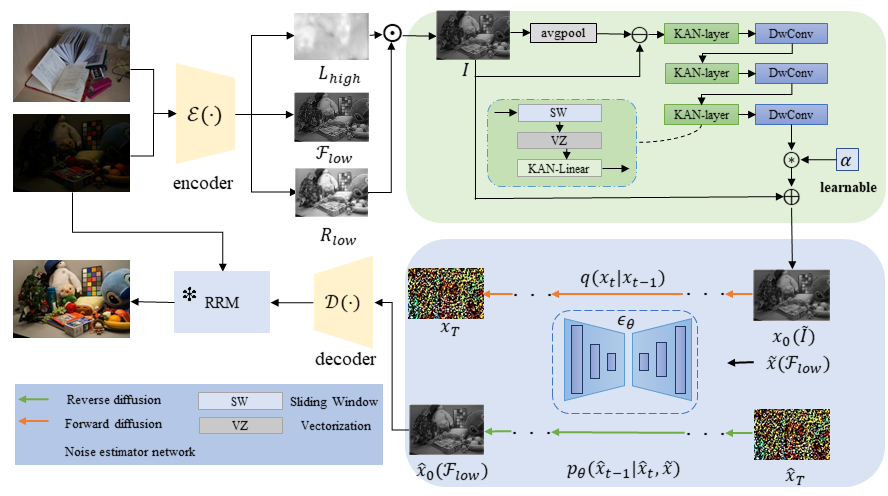
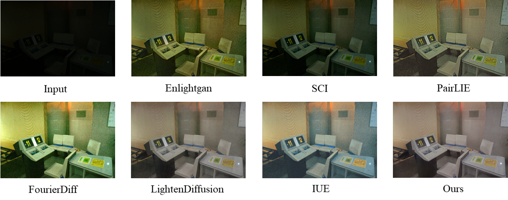
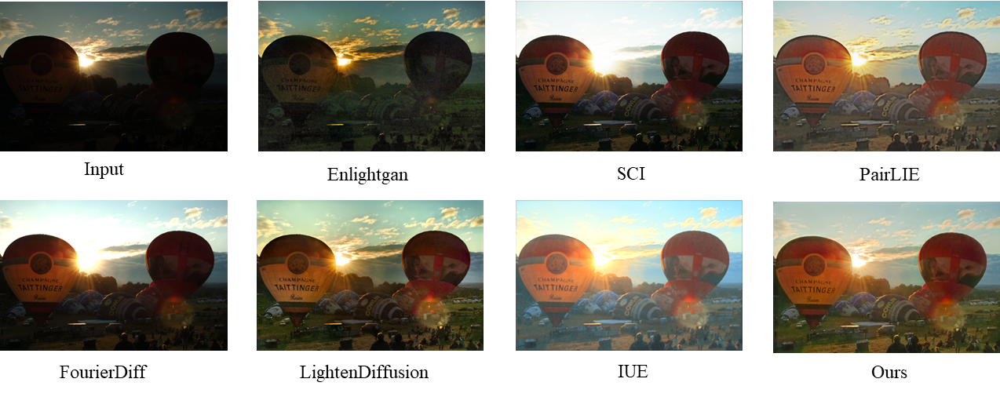

# Dynamic Nonlinear Networks for Adaptive Low-Light Image Enhancement

> **Abstract:** *While diffusion-based methods have advanced low-light image enhancement, they face two critical limitations: the tendency to suppress complex high-frequency details by misinterpreting them as noise, and persistent artifacts such as insufficient denoising and color shifts. To address these challenges, we propose a novel framework, Dynamic Nonlinear Networks, inspired by the Kolmogorov-Arnold representation theorem. Our framework introduces a Dynamic Edge Feature Extractor (DEFE), which leverages learnable nonlinear convolutions and adaptive residual connections to reconstruct high-frequency features prior to the diffusion process, effectively preventing the diffusion process from erroneously suppressing fine textures. To further enforce structural fidelity, we introduce a dedicated edge-preserving loss. Furthermore, to tackle residual artifacts, we leverage a Residual Refinement Module  that is conditioned on the original low-light input. This mechanism explicitly couples noise estimation with illumination degradation, enabling precise correction of noise and color deviations without sacrificing detail through uniform smoothing. Extensive experiments on benchmark datasets, including LOL and SICE, demonstrate that our method achieves state-of-the-art performance, particularly in preserving intricate details and ensuring color fidelity.* 
>

<p align="center">
  
</p>

---

## Installation

     python=3.9
     pytorch=1.13.1
     torchvision==0.14.1
     scipy==1.10.1 
     opencv-python=4.6.0.66

## Pretrained models

We provide the Google Drive links for the following pre-trained weights.

## Testing

You can run the following code for testing：

    python evaluate.py

## Training

You need to modify ```datasets/dataset.py``` slightly for your environment, and then train your own model by running the following commad. 

    python train.py
    
## Results

<p align="center">
  
</p>

<p align="center">
  
</p>

<p align="center">
  
</p>

